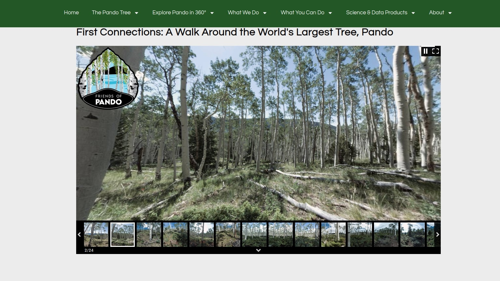

<!-- Improved compatibility of back to top link: See: https://github.com/othneildrew/Best-README-Template/pull/73 -->
<a name="readme-top"></a>
<!--
*** Thanks for checking out the Best-README-Template. If you have a suggestion
*** that would make this better, please fork the repo and create a pull request
*** or simply open an issue with the tag "enhancement".
*** Don't forget to give the project a star!
*** Thanks again! Now go create something AMAZING! :D
-->


<!-- PROJECT SHIELDS -->
<!--
*** I'm using markdown "reference style" links for readability.
*** Reference links are enclosed in brackets [ ] instead of parentheses ( ).
*** See the bottom of this document for the declaration of the reference variables
*** for contributors-url, forks-url, etc. This is an optional, concise syntax you may use.
*** https://www.markdownguide.org/basic-syntax/#reference-style-links
-->
[![Contributors][contributors-shield]][contributors-url]
[![Forks][forks-shield]][forks-url]
[![Stargazers][stars-shield]][stars-url]
[![Issues][issues-shield]][issues-url]
[![MIT License][license-shield]][license-url]
[![LinkedIn][linkedin-shield]][linkedin-url]


<!-- PROJECT LOGO -->
<br />
<div align="center">
  <a href="https://github.com/Pando-Software-Group/PandoImageSequencing">
    
  </a>

<h3 align="center">Pando Image Sequencing</h3>

  <p align="center">
    An image-sequencing algorithm for the Pando Photographic Survey
    <br />
    <a href="https://pando-software-group.github.io/PandoImageSequencing/"><strong>Explore the docs  »</strong></a>
    <br />
    <br />
    <a href="https://github.com/Pando-Software-Group/PandoImageSequencing">View Demo</a>
    ·
    <a href="https://github.com/Pando-Software-Group/PandoImageSequencing/issues">Report Bug</a>
    ·
    <a href="https://github.com/Pando-Software-Group/PandoImageSequencing/issues">Request Feature</a>
  </p>
</div>


<!-- TABLE OF CONTENTS -->
<details>
  <summary>Table of Contents</summary>
  <ol>
    <li>
      <a href="#about-the-project">About The Project</a>
      <ul>
        <li><a href="#built-with">Built With</a></li>
      </ul>
    </li>
    <li>
      <a href="#getting-started">Getting Started</a>
      <ul>
        <li><a href="#prerequisites">Prerequisites</a></li>
        <li><a href="#installation">Installation</a></li>
      </ul>
    </li>
    <li><a href="#usage">Usage</a></li>
    <li><a href="#roadmap">Roadmap</a></li>
    <li><a href="#contributing">Contributing</a></li>
    <li><a href="#license">License</a></li>
    <li><a href="#contact">Contact</a></li>
    <li><a href="#acknowledgments">Acknowledgments</a></li>
  </ol>
</details>


<!-- ABOUT THE PROJECT -->
## About The Project



Development of software for the alignment of images in the Pando Photographic Survey with incorrect timestamps.

<p align="right">(<a href="#readme-top">back to top</a>)</p>


<!-- ### Built With

* [![Python][https://upload.wikimedia.org/wikipedia/commons/thumb/c/c3/Python-logo-notext.svg/1869px-Python-logo-notext.svg.png][https://python.org]
* [![React][React.js]][React-url]
* [![Vue][Vue.js]][Vue-url]
* [![Angular][Angular.io]][Angular-url]
* [![Svelte][Svelte.dev]][Svelte-url]
* [![Laravel][Laravel.com]][Laravel-url]
* [![Bootstrap][Bootstrap.com]][Bootstrap-url]
* [![JQuery][JQuery.com]][JQuery-url]

<p align="right">(<a href="#readme-top">back to top</a>)</p>


 -->
<!-- GETTING STARTED -->
## Getting Started

🚧 Under Construction 🚧

### Prerequisites

This pipeline is designed to run on Unix infrastructure; it will work natively on macOS and Linux, but Windows users should install Windows Subsystem for Linux. You will need the following command-line tools installed:

- [ ] exiftools
- [ ] conda
- [ ] grip (if editing markdown files) 

### Installation

#### macOS

1. Ensure the above command-line tools are installed (e.g., using `homebrew`).
2. Create a `conda` environment for your Pando tools with
```
conda create --name pando
```
3. Activate the environment with 
```
conda activate pando
```
4. Install pip with
```
conda install pip
```
5. Clone the PandoImageSequencing repository with
```
git clone git@github.com:Pando-Software-Group/PandoImageSequencing.git
```
6. `cd` into the repository and install dependencies with
```
pip install -r requirements
```
7. Compile the documentation with 
```
PYTHONPATH=. pdoc ../PandoImageSequencing/ -o ./docs/
```


### Problems with Tkinter

If you're having issues with installing tkinter on Linux, try

```
sudo apt-get install python3-tk
```

### Problems with LibGL

If you're having issues with libGL on Linux, try

```
sudo apt-get install ffmpeg libsm6 libxext6
```


<p align="right">(<a href="#readme-top">back to top</a>)</p>


<!-- USAGE EXAMPLES -->
## Usage

To start the pipeline, ensure you have your JPG and DNG files for a route downloaded, and run
```
python pipeline.py
```
in the `./PandoImageSequencing/` directory. Follow the on-screen steps in sequence to perform the sequencing. 


<!-- ROADMAP -->
## Roadmap

- [ ] Test on additional datasets
- [ ] Develop front-facing user-interface
- [ ] Make globally installable
    - [ ] Windows/Linux

See the [open issues](https://github.com/Pando-Software-Group/PandoImageSequencing/issues) for a full list of proposed features (and known issues).

<p align="right">(<a href="#readme-top">back to top</a>)</p>


<!-- CONTRIBUTING -->
## Contributing

Contributions are what make the open source community such an amazing place to learn, inspire, and create. Any contributions you make are **greatly appreciated**.

If you have a suggestion that would make this better, please fork the repo and create a pull request. You can also simply open an issue with the tag "enhancement".
Don't forget to give the project a star! Thanks again!

1. Fork the Project
2. Create your Feature Branch (`git checkout -b feature/AmazingFeature`)
3. Commit your Changes (`git commit -m 'Add some AmazingFeature'`)
4. Push to the Branch (`git push origin feature/AmazingFeature`)
5. Open a Pull Request

<p align="right">(<a href="#readme-top">back to top</a>)</p>


<!-- LICENSE -->
## License

Distributed under the GPLv3 License. See `LICENSE.txt` for more information.

<p align="right">(<a href="#readme-top">back to top</a>)</p>


<!-- CONTACT -->
## Contact

Lance Oditt - [@iamthepandotree](https://twitter.com/iamthepandotree) - lance@friendsofpando.com

Project Link: [https://github.com/Pando-Software-Group/PandoImageSequencing](https://github.com/Pando-Software-Group/PandoImageSequencing)

<p align="right">(<a href="#readme-top">back to top</a>)</p>


<!-- ACKNOWLEDGMENTS -->
## Acknowledgments

* [Lance Oditt]()
* [Hope Smith]()
<!-- * []() -->

<p align="right">(<a href="#readme-top">back to top</a>)</p>


<!-- MARKDOWN LINKS & IMAGES -->
<!-- https://www.markdownguide.org/basic-syntax/#reference-style-links -->
[contributors-shield]: https://img.shields.io/github/contributors/Pando-Software-Group/PandoImageSequencing.svg?style=for-the-badge
[contributors-url]: https://github.com/Pando-Software-Group/PandoImageSequencing/graphs/contributors
[forks-shield]: https://img.shields.io/github/forks/Pando-Software-Group/PandoImageSequencing.svg?style=for-the-badge
[forks-url]: https://github.com/Pando-Software-Group/PandoImageSequencing/network/members
[stars-shield]: https://img.shields.io/github/stars/Pando-Software-Group/PandoImageSequencing.svg?style=for-the-badge
[stars-url]: https://github.com/Pando-Software-Group/PandoImageSequencing/stargazers
[issues-shield]: https://img.shields.io/github/issues/Pando-Software-Group/PandoImageSequencing.svg?style=for-the-badge
[issues-url]: https://github.com/Pando-Software-Group/PandoImageSequencing/issues
[license-shield]: https://img.shields.io/github/license/Pando-Software-Group/PandoImageSequencing.svg?style=for-the-badge
[license-url]: https://github.com/Pando-Software-Group/PandoImageSequencing/blob/master/LICENSE.txt
[linkedin-shield]: https://img.shields.io/badge/-LinkedIn-black.svg?style=for-the-badge&logo=linkedin&colorB=555
[linkedin-url]: https://linkedin.com/in/jrfarah
[product-screenshot]: images/screenshot.png
[Next.js]: https://img.shields.io/badge/next.js-000000?style=for-the-badge&logo=nextdotjs&logoColor=white
[Next-url]: https://nextjs.org/
[React.js]: https://img.shields.io/badge/React-20232A?style=for-the-badge&logo=react&logoColor=61DAFB
[React-url]: https://reactjs.org/
[Vue.js]: https://img.shields.io/badge/Vue.js-35495E?style=for-the-badge&logo=vuedotjs&logoColor=4FC08D
[Vue-url]: https://vuejs.org/
[Angular.io]: https://img.shields.io/badge/Angular-DD0031?style=for-the-badge&logo=angular&logoColor=white
[Angular-url]: https://angular.io/
[Svelte.dev]: https://img.shields.io/badge/Svelte-4A4A55?style=for-the-badge&logo=svelte&logoColor=FF3E00
[Svelte-url]: https://svelte.dev/
[Laravel.com]: https://img.shields.io/badge/Laravel-FF2D20?style=for-the-badge&logo=laravel&logoColor=white
[Laravel-url]: https://laravel.com
[Bootstrap.com]: https://img.shields.io/badge/Bootstrap-563D7C?style=for-the-badge&logo=bootstrap&logoColor=white
[Bootstrap-url]: https://getbootstrap.com
[JQuery.com]: https://img.shields.io/badge/jQuery-0769AD?style=for-the-badge&logo=jquery&logoColor=white
[JQuery-url]: https://jquery.com 
